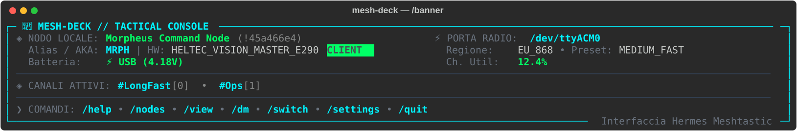
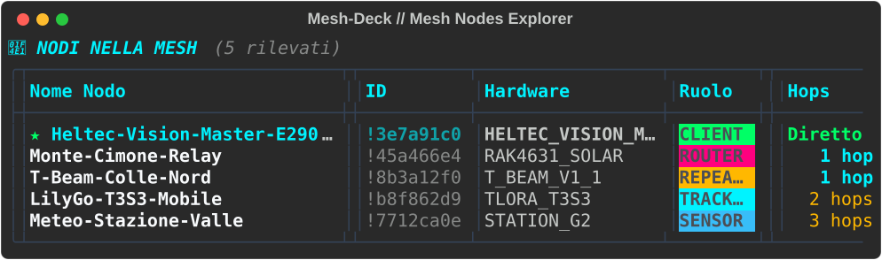
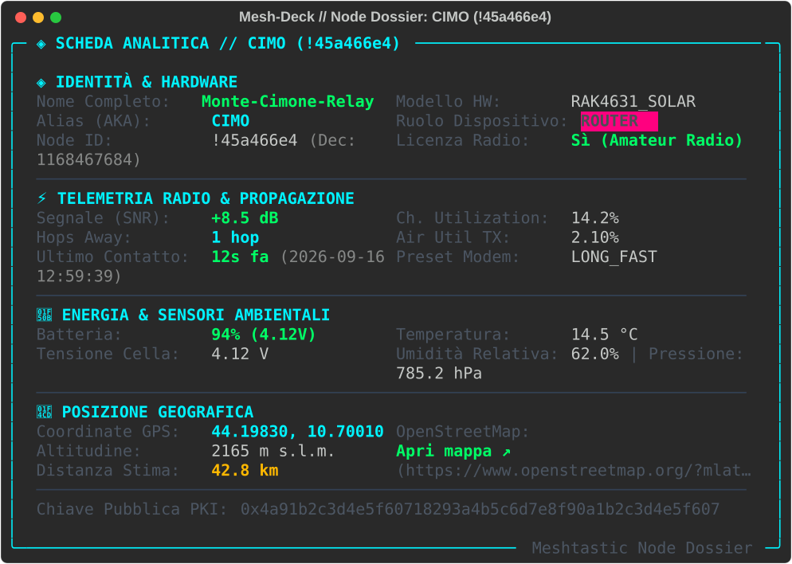
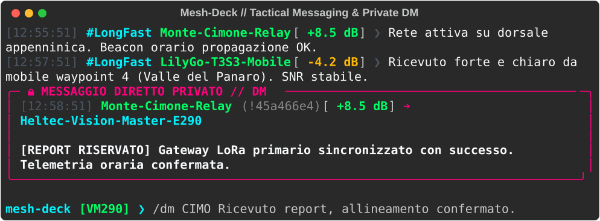

# 📡 Mesh-Deck

**Mesh-Deck** è una console interattiva terminale (CLI/TUI) in stile *Hermes* ad alte prestazioni per esplorare, gestire e comunicare con dispositivi radio e reti **[Meshtastic](https://meshtastic.org/)**.

Progettata per scenari multi-nodo sul campo (es. Heltec Vision Master E290, LilyGo T-Beam / T3S3, RAK Wireless WisBlock), offre un'interfaccia ricca di dettagli visivi ad alto contrasto, autocompletamento intelligente, streaming dei messaggi in tempo reale senza interruzione del prompt e passaggio istantaneo (*hot-switching*) tra dispositivi LoRa USB collegati.

---

## 📸 Anteprima Visiva dell'Interfaccia Tattica

### 1. Banner Hermes & Stato Operativo Locale
Visualizzazione a colpo d'occhio dello stato radio, nodo locale, canali attivi, preset modem e saturazione RF.


### 2. Node Explorer con Telemetria Mesh
Tabella responsive con indicatore nodo locale `★`, segnale SNR con codifica cromatica, hop count, stato alimentazione e stima geodetica.


### 3. Scheda Analitica Dettagliata per Singolo Nodo (`/node`)
Dossier completo con modello hardware, metriche RF, sensori ambientali (temperatura, umidità, pressione), coordinate GPS e link OpenStreetMap.


### 4. Messaggistica Tattica & Messaggi Diretti Privati (`/dm`)
Streaming asincrono dei messaggi di canale e risalto immediato per i messaggi privati (DM) con box neon fucsia ad alta visibilità.


---

## ⚡ Caratteristiche Principali

- **Multi-Device Auto-Discovery**: Individuazione automatica e fingerprinting delle radio connesse su porte USB (`/dev/ttyACM*`, `/dev/ttyUSB*`).
- **Hot-Switching a Caldo**: Commutazione istantanea tra più radio LoRa collegate via comando `/switch` senza riavviare l'applicazione.
- **Hermes-Style REPL**: Prompt contestuale (`mesh-deck [AKA] ❯`) potenziato da `prompt_toolkit` con autocompletamento di comandi, porte e alias nodi.
- **Streaming Asincrono Senza Interruzioni**: Implementazione di `patch_stdout` che consente ai messaggi radio in arrivo di stamparsi sopra il prompt senza spezzare o corrompere il testo in digitazione dell'operatore.
- **Node Explorer & Geodesia Haversine**: Calcolo automatico della distanza ortodromica dal nodo locale e generazione di collegamenti a mappe satellitari/OpenStreetMap.
- **Crittografia & Canali Multipli**: Supporto per canali primari e secondari (PSK standard o personalizzata) e invio di DM cifrati punto-a-punto.

---

## 📚 Documentazione Completa

* 📖 **[Manuale Utente & Guida Operativa (docs/USER_GUIDE.md)](docs/USER_GUIDE.md)**: Manuale completo con sintassi dettagliata dei comandi slash, interpretazione visiva dei badge (SNR, batteria, ruoli), architettura asincrona e guida al troubleshooting.
* 📋 **[Requisiti di Dettaglio (REQUIREMENTS.md)](REQUIREMENTS.md)**: Specifica completa dei requisiti funzionali, non funzionali, di interfaccia e architettura.
* 🚀 **[Piano di Implementazione (IMPLEMENTATION_PLAN.md)](IMPLEMENTATION_PLAN.md)**: Roadmap dettagliata delle fasi operative di sviluppo del progetto.

---

## ⌨️ Tabella Rapida dei Comandi Slash

All'interno della console interattiva `mesh-deck`, puoi utilizzare i seguenti comandi slash:

| Comando | Argomenti | Descrizione |
| :--- | :--- | :--- |
| **`/help`** *(o `/?`)* | *(nessuno)* | Mostra la tabella di aiuto con l'elenco di tutti i comandi disponibili. |
| **`/nodes`** | `[active\|snr\|hops\|name]` | Elenca i nodi visibili nella mesh con telemetria, ordinamenti e filtri. |
| **`/node`** | `<id\|aka\|nome>` | Visualizza la scheda analitica dettagliata con telemetria e coordinate GPS. |
| **`/send`** | `<testo>` | Invia un messaggio broadcast sul canale primario *(oppure digita direttamente il testo)*. |
| **`/dm`** | `<id\|aka\|nome> <testo>` | Invia un messaggio diretto privato riservato a uno specifico nodo. |
| **`/channels`** | *(nessuno)* | Mostra l'elenco dei canali radio configurati, ruoli e stato crittografia PSK. |
| **`/info`** | *(nessuno)* | Visualizza lo stato hardware della radio, firmware, regione RF e preset modem. |
| **`/switch`** | `[porta\|indice]` | Passa a caldo a un'altra radio LoRa USB collegata al PC. |
| **`/scan`** | *(nessuno)* | Rileva ed elenca tutte le radio LoRa collegate al computer e il loro stato. |
| **`/banner`** | *(nessuno)* | Ristampa il banner tattico di stato Hermes in cima allo schermo. |
| **`/clear`** | *(nessuno)* | Pulisce la schermata del terminale preservando la sessione attiva. |
| **`/quit`** *(o `/exit`, `/q`)*| *(nessuno)* | Chiude ordinatamente la connessione radio ed esce dall'applicazione (*73!*). |

---

## 🛠️ Stack Tecnologico

- **Runtime & Gestione Pacchetti**: [Python 3.11+](https://www.python.org/) & [uv](https://github.com/astral-sh/uv)
- **Protocollo Radio**: [meshtastic-python](https://pypi.org/project/meshtastic/) (interfaccia seriale e bridge eventi PubSub)
- **Terminal UI & Styling**: [Rich](https://rich.readthedocs.io/) (rendering tabelle, pannelli, badge e esportazione SVG)
- **Interactive REPL**: [prompt_toolkit](https://python-prompt-toolkit.readthedocs.io/) con modulo `patch_stdout`
- **Comunicazione Seriale**: [pyserial](https://pyserial.readthedocs.io/)

---

## 🚀 Avvio Rapido

```bash
# 1. Clona il repository
git clone https://github.com/raythekool/mesh-deck.git
cd mesh-deck

# 2. Avvia la console interattiva con uv
uv run mesh-deck
```

### Flag da Riga di Comando (CLI)

```bash
# Elenca tutte le radio Meshtastic collegate via USB ed esci
uv run mesh-deck --list

# Connettiti forzatamente a una porta seriale specifica
uv run mesh-deck --port /dev/ttyACM0

# Stampa la tabella nodi in modalità non-interattiva (per script / cronjob)
uv run mesh-deck --nodes
```

---

## 📄 Licenza

Distribuito sotto licenza [MIT](LICENSE).
