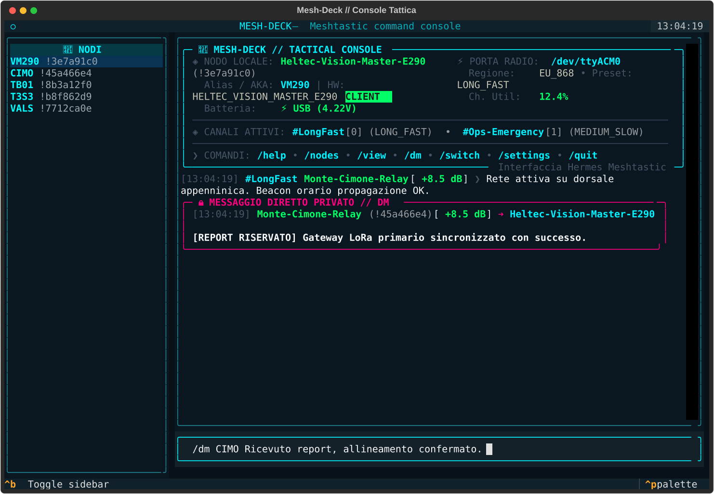
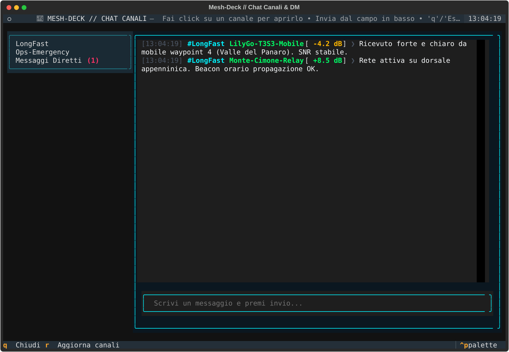

# 📡 Mesh-Deck

Mesh-Deck is a high-performance interactive terminal console for exploring, managing, and communicating with **Meshtastic** radios and mesh networks.

It is designed for field operations and multi-node monitoring across devices such as Heltec, LilyGo, and RAK boards. The interface emphasizes rapid visual scanning, node telemetry, command completion, and real-time message streaming without interrupting command input.

---

## 📸 Tactical Interface Preview

### 1. Hermes banner and local system status

An at-a-glance view of radio state, local node status, active channels, modem preset, and RF saturation.


### 2. Mesh node explorer and telemetry

A responsive node table with the local node marker, SNR color coding, hop count, power state, and geodesic distance estimate.


### 3. Detailed single-node analytics panel (`/node`)

A complete node dossier with hardware details, RF metrics, environmental sensors, GPS coordinates, and OpenStreetMap links.


### 4. Tactical messaging and direct messages (`/dm`)

Asynchronous channel streaming with immediate highlighting for private direct messages and highly visible DM traffic.


### 5. Main console with the node sidebar

The live command console with the mouse-clickable node sidebar docked on the left, alongside the tactical banner and streaming messages.



### 6. Mouse-usable channel and DM chat viewer (`/chat`)

A full-screen chat view: click a channel to switch, see unread badges on the "Direct Messages" entry, and read live broadcast traffic.



---

## ⚡ Core Features

- **Multi-device auto-discovery**: Automatically detects Meshtastic radios on USB serial ports such as `/dev/ttyACM*` and `/dev/ttyUSB*`.
- **Hot switching**: Switch between multiple connected LoRa radios with `/switch` without restarting the app.
- **Full-screen Textual console**: Context-aware input, persistent command history, dynamic suggestions for commands, ports, and node aliases. `Tab` completes without executing; `Enter` accepts the highlighted suggestion.
- **Asynchronous streaming**: Incoming radio messages are appended to the scrollable log without interrupting the operator’s typing.
- **Node explorer and Haversine geodesy**: Calculates an approximate distance from the local node and produces links to maps and OpenStreetMap views.
- **Encryption and multi-channel support**: Works with primary and secondary channels, standard or custom PSK, and direct encrypted DM traffic.
- **Mouse-usable channel chat viewer**: `/chat` opens a full-screen, click-driven view of every channel plus a "Direct Messages" entry, combining local history with the live message stream and unread badges.
- **Node sidebar**: A dockable, mouse-clickable list of known nodes (with role, SNR, long name, and last-heard at a glance) stays visible next to the console. Two pill buttons above the list cycle the sort criterion (last heard, signal, hops, name) and the filter (all, active, favorites). Click a row, or select it and press `Enter`, to open its detail in a single dedicated card above the log; picking another node replaces that same card instead of stacking new panels. Drag the divider on the sidebar's right edge to resize it. Toggle the sidebar with `Ctrl+B`, close the open card with `Esc`; sidebar visibility, width, sort, and filter are remembered across restarts.
- **Toast notifications**: Incoming broadcasts and DMs raise an in-app toast (severity-coded, DMs stand out) while you keep working in the console; toggle with `/settings notifications <on|off>`.
- **Local on-disk history**: Node sightings (with their characteristics and observation timestamps) and sent/received messages are appended to JSONL files under `~/.config/mesh-deck/history/`, fully opt-in and toggleable with `/settings history <on|off>`.

---

## ⌨️ TUI Controls

| Action                          | Control                                     |
| :------------------------------ | :------------------------------------------ |
| Send a command or message       | `Enter`                                     |
| Complete without executing      | `Tab`                                       |
| Accept the suggested command    | `Enter`                                     |
| Browse and apply a suggestion   | Down arrow, Up/Down arrows, `Enter`         |
| Browse command history          | Up/Down arrows in the command field         |
| Clear current input             | `Ctrl+C`                                    |
| Hide suggestions                | `Esc`                                       |
| Toggle the node sidebar         | `Ctrl+B`                                    |
| Open a node from the sidebar    | Click a row, or select it and press `Enter` |
| Open the Node Explorer          | `/view` or `/tui`                           |
| Open the channel/DM chat viewer | `/chat`                                     |

The command history keeps the last 100 entries in `~/.config/mesh-deck/settings.json`. Incoming messages and command output stay in the scrollable log while the input field keeps focus.

On interactive startup, Mesh-Deck first shows the Meshtastic devices it detected. Use the Up/Down arrows and `Enter` to select one, `r` to refresh the list, and `q` or `Esc` to cancel. The default port, if configured, is highlighted; `--port` bypasses it for scripts.

---

## 📚 Documentation

- 📖 [User Guide and Operational Guide](docs/USER_GUIDE.md): Full command syntax, visual badge interpretation, async architecture notes, and troubleshooting guidance.
- 📋 [Requirements](REQUIREMENTS.md): Functional, non-functional, UI, and architecture requirements.
- 🚀 [Implementation Plan](IMPLEMENTATION_PLAN.md): Roadmap for the project’s development phases.

---

## ⌨️ Quick Slash Command Reference

Inside the interactive `mesh-deck` console, you can use the following slash commands:

| Command                                | Arguments                                                 | Description                                                                                                                                |
| :------------------------------------- | :-------------------------------------------------------- | :----------------------------------------------------------------------------------------------------------------------------------------- |
| **`/help`** or **`/?`**                | *(none)*                                                  | Displays the help table with all supported slash commands.                                                                                 |
| **`/nodes`**                           | `[active\|snr\|hops\|name\|last_heard]`                   | Lists visible mesh nodes with telemetry, ordering, and filters.                                                                            |
| **`/view`** or **`/tui`**              | *(none)*                                                  | Opens the interactive full-screen node table with mouse-click sorting on table headers.                                                    |
| **`/chat`**                            | *(none)*                                                  | Opens the interactive full-screen channel/DM chat viewer: click a channel to view its history and live messages, type to send a broadcast. |
| **`/node`**                            | `<id\|aka\|name>`                                         | Shows the detailed analytics panel for a node.                                                                                             |
| **`/send`**                            | `<text>`                                                  | Sends a broadcast message on the primary channel.                                                                                          |
| **`/dm`**                              | `<id\|aka\|name> <text>`                                  | Sends a private direct message to a specific node.                                                                                         |
| **`/channels`**                        | *(none)*                                                  | Shows radio channel configuration, roles, and PSK security state.                                                                          |
| **`/info`**                            | *(none)*                                                  | Displays hardware status, firmware, RF region, and modem preset.                                                                           |
| **`/settings`**                        | `[lang\|theme\|port\|sort\|mode\|notifications\|history]` | Shows or updates user settings, including notification toasts and local history persistence.                                               |
| **`/switch`**                          | `[port\|index]`                                           | Hot-switches to another connected LoRa USB device.                                                                                         |
| **`/scan`**                            | *(none)*                                                  | Detects and lists all connected LoRa/Meshtastic devices.                                                                                   |
| **`/banner`**                          | *(none)*                                                  | Re-renders the tactical Hermes status banner.                                                                                              |
| **`/clear`**                           | *(none)*                                                  | Clears the terminal screen while preserving the active session.                                                                            |
| **`/restart`**                         | *(none)*                                                  | Reloads settings and refreshes the console without disconnecting the radio.                                                                |
| **`/quit`** or **`/exit`** or **`/q`** | *(none)*                                                  | Cleanly closes the connection and exits the app.                                                                                           |

---

## 🛠️ Tech Stack

- **Runtime and package management**: [Python 3.11+](https://www.python.org/) and [uv](https://github.com/astral-sh/uv)
- **Radio protocol**: [meshtastic-python](https://pypi.org/project/meshtastic/) for serial bridging and PubSub event handling
- **Terminal UI and styling**: [Rich](https://rich.readthedocs.io/) for tables, panels, badges, and SVG export
- **Interactive TUI**: [Textual](https://textual.textualize.io/) for reactive input and rich console interactions
- **Serial communication**: [pyserial](https://pyserial.readthedocs.io/)

---

## 🚀 Quick Start

```bash
# 1. Clone the repository
git clone https://github.com/raythekool/mesh-deck.git
cd mesh-deck

# 2. Launch the interactive console with uv
uv run mesh-deck
```

### Command-line flags

```bash
# List all Meshtastic radios connected via USB and exit
uv run mesh-deck --list

# Connect to a specific serial port
uv run mesh-deck --port /dev/ttyACM0

# Print the node table in non-interactive mode for scripts or cron jobs
uv run mesh-deck --nodes

# Launch directly into the Textual node explorer
uv run mesh-deck --tui
```

### Agent-friendly CLI

The non-interactive subcommands support human-readable output by default and a
stable JSON envelope with `--output json`:

```bash
uv run mesh-deck scan --output json
uv run mesh-deck nodes --sort snr --active --output json
uv run mesh-deck node TRIN --port /dev/ttyACM0 --output json
uv run mesh-deck info --output json
uv run mesh-deck channels --output json
```

Successful responses use:

```json
{"ok": true, "command": "scan", "data": {"devices": [], "count": 0}}
```

Failures use `ok: false` and a stable `error` object containing `code`,
`message`, and `details`. Exit codes are `2` for invalid input, `3` for a
missing node, `4` when no device is available, `5` for connection failures,
and `6` for transmission failures.

Message commands are previews unless `--confirm` is explicitly provided:

```bash
uv run mesh-deck send "Weather check" --output json
uv run mesh-deck send "Weather check" --channel 1 --confirm --output json
uv run mesh-deck dm TRIN "Return to base" --confirm --output json
```

### MCP server

Run the local Model Context Protocol server over stdio:

```bash
uv run mesh-deck mcp
# Or pin the radio used by all tools:
uv run mesh-deck mcp --port /dev/ttyACM0
```

Generic MCP client configuration:

```json
{
  "mcpServers": {
    "mesh-deck": {
      "command": "uv",
      "args": ["run", "mesh-deck", "mcp", "--port", "/dev/ttyACM0"]
    }
  }
}
```

The server exposes `scan_devices`, `get_radio_info`, `list_nodes`, `get_node`,
`list_channels`, `send_broadcast`, and `send_direct_message`. The two send
tools return a preview by default and transmit only when called with
`confirm=true`. Channel keys and raw channel configuration are never returned.

### Chat viewer, notifications & local history

`/chat` opens a full-screen, mouse-usable chat viewer: click a channel (or the
synthetic "Direct Messages" entry) in the sidebar to see its history and live
messages, and type in the input field to send a broadcast on the selected
channel (DMs must still be sent with `/dm`, since they need an explicit
target). Toggle it off entirely by never invoking it — it adds no background
overhead when unused.

Incoming messages also raise an in-app toast notification (title/severity vary
for DMs vs. broadcasts) so you notice new traffic even while focused
elsewhere in the console. Disable with `/settings notifications off`.

When enabled (default), Mesh-Deck keeps an on-disk, append-only history under
`~/.config/mesh-deck/history/`:

- `nodes.jsonl`: one line per *materially changed* node observation (name,
  hardware, role, battery, position, SNR, hops), each tagged with an
  `observed_at` timestamp.
- `messages.jsonl`: one line per sent (`direction: "out"`) or received
  (`direction: "in"`) message, tagged with a `recorded_at` timestamp, usable
  to reconstruct per-channel/DM chat history (this is what powers `/chat`'s
  history preload).

Both files are plain JSONL (one JSON object per line) so they're easy to
`grep`, `jq`, or import elsewhere. Disable persistence with
`/settings history off`.

---

## 📄 License

Distributed under the [MIT](LICENSE) license.
