# UI Development Proposals

> **Status:** all sections are implemented in `main`, with sections 10 and 13 intentionally scoped to safe first slices. Each SVG is a wireframe that makes the intended interaction and information hierarchy reviewable before code is written.

## Goals

The current Rich + Textual architecture, semantic theme palette, internal screens, and live radio bridge are sound. These proposals deliberately build on that base rather than introducing a web UI, a map dependency, or a second application.

The recommended implementation order is:

1. Node explorer master/detail and compact responsive layout.
2. Complete live localization, persistent radio state, and command progress.
3. Direct-message conversations and a clearer device selector.
4. Observability and safe device configuration.
5. Rendering consistency, then topology and historical telemetry after real data is available.
6. Accessibility checks as a release gate for every theme.

## ✅ 1. Node Explorer: Master / Detail — Implemented

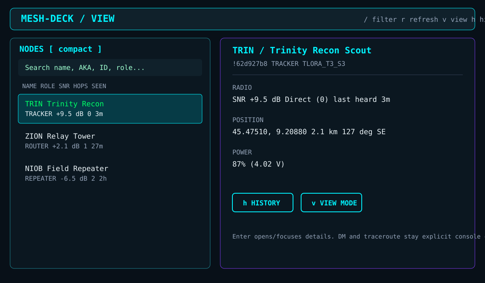

`/view` already filters and sorts nodes but a selected row has no action. Selection should open the existing node detail in a right-side pane on wide terminals, with explicit actions:

- `Enter`: open or focus details.
- `h`: open node history (when history persistence is enabled).
- `v`: cycle the view mode (auto/full/compact).

DM and traceroute remain deliberate slash commands typed in the console rather than row buttons, so an operator never fires a transmission with a stray click. Unavailable actions should stay hidden until they are implemented.

## ✅ 2. Responsive Compact Layout — Implemented

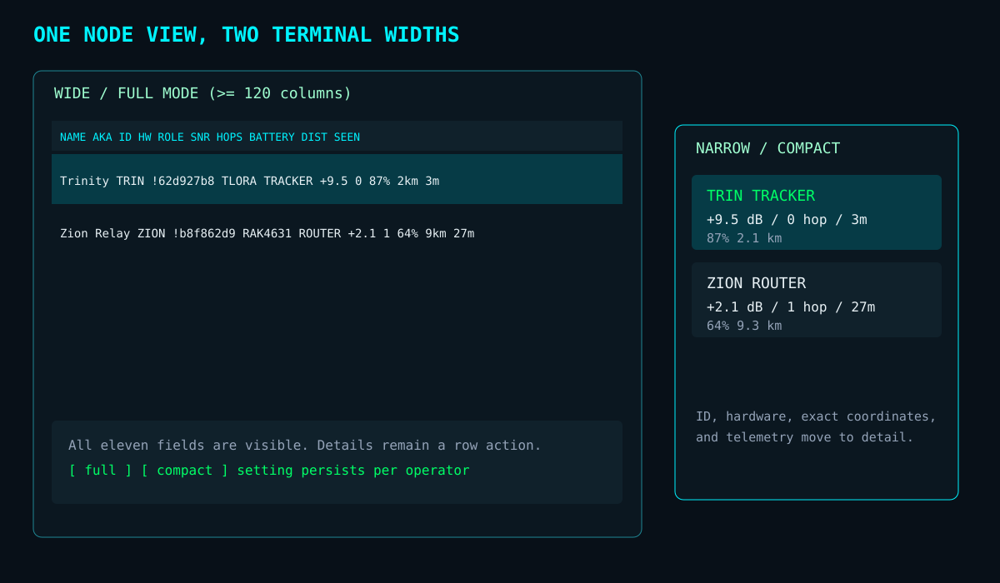

The current node table has eleven columns in both Rich and Textual. The compact layout retains only operator-critical fields (identity, role, SNR, hops, battery, and last heard), while the existing detail pane contains the full hardware, location, key, and telemetry data.

Use an automatic breakpoint based on terminal width, plus a persisted `full` / `compact` toggle. This preserves the full current view on wide desktops without making small laptops or field terminals unusable.

## ✅ 3. Complete Live Localization — Implemented

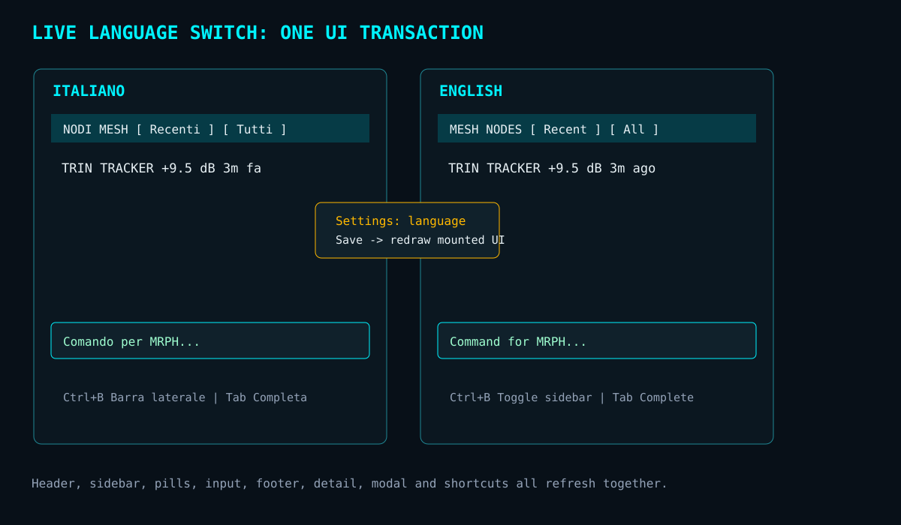

Changing language already updates command completion and the input prompt. The same operation should redraw the mounted title, sidebar heading, sort and filter pills, footer bindings, node detail, and any open modal. The screen should visibly update as a single transaction, with no `/restart` needed.

## ✅ 4. Persistent Radio Status Strip — Implemented

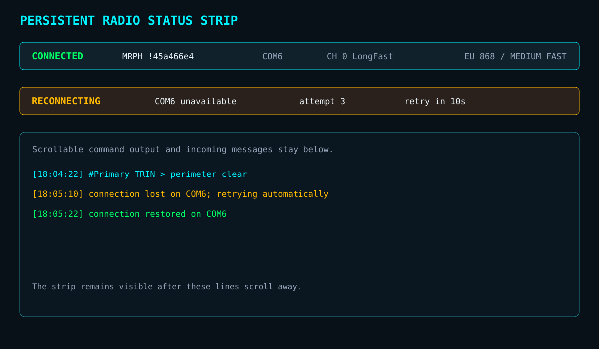

Connection events currently enter the scrolling log. Add a small persistent strip below the header that always answers:

- Which local node and serial port are active?
- What channel is selected?
- Is the radio connected, reconnecting, or unavailable?
- If reconnecting, which retry is running and when is the next one?

This is a status surface, not a second banner: it should consume one line and remain visible while the log scrolls.

## ✅ 5. Command Progress — Implemented

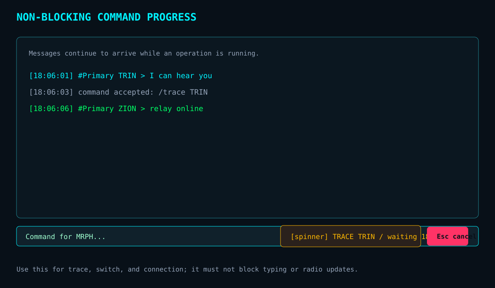

Potentially slow operations (`/trace`, `/switch`, initial connection) run outside the Textual event loop and now surface a durable progress line near the input. The user can keep reading messages and can see precisely what is pending rather than hunting for a line in the log.

`Esc` cancels `/trace` cooperatively by stopping the response wait and removing its waiter. `/switch` and initial connection show progress but do not claim cancellation because the underlying serial handshake cannot be interrupted safely.

## ✅ 6. Direct-message Conversations — Implemented

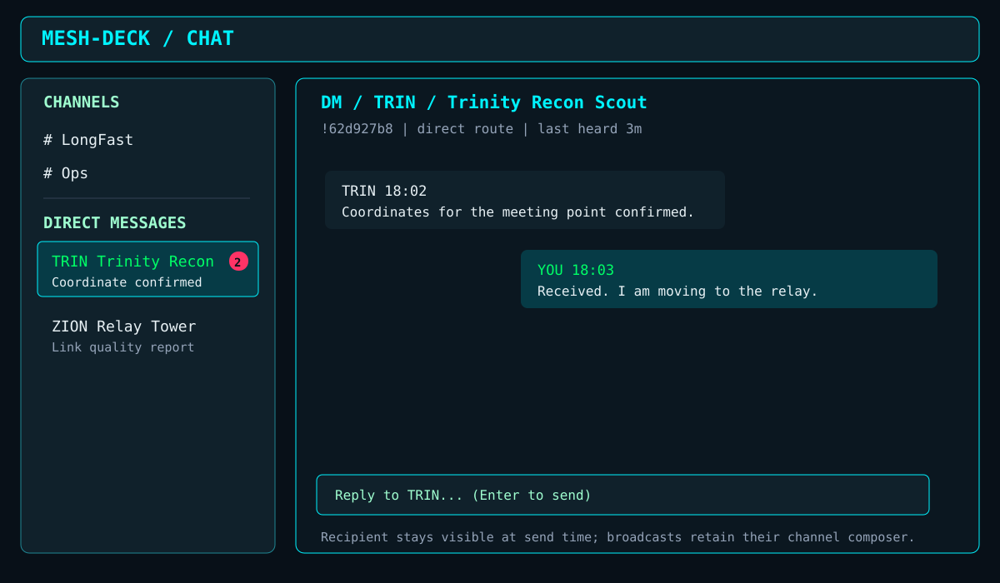

The chat now creates individual direct-message conversations keyed by peer, with per-conversation unread badges, an explicit recipient in the compose area, and a visible send target. This removes the context switch back to `/dm` for replies while making accidental replies to the wrong node harder.

`/dm` remains the deliberate way to start a new conversation before any message has been exchanged.

## ✅ 7. Device Selection — Implemented

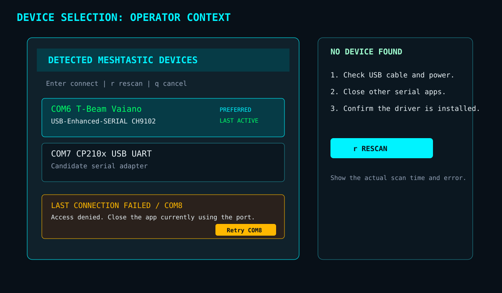

The initial device screen distinguishes:

- Preferred/default port.
- Currently active port after a return from `/switch`.
- Last failed connection and retry action.
- No-device state with concrete cable, driver, and scan guidance.

The retry binding is only exposed after a failure. The empty state offers cable, power, driver, and port-ownership recovery guidance before rescan.

This is especially useful where several USB serial adapters look similar.

## ✅ 8. One Node Presentation Model — Implemented

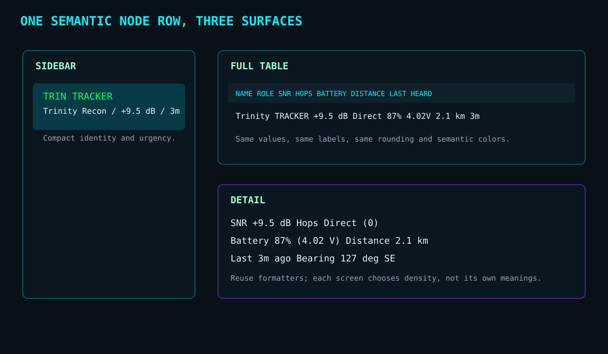

Sidebar, `/nodes`, and `/view` now share a `NodePresentation` model for SNR, hops, battery, distance, and last-heard values. Each surface chooses its density while preserving semantic formatter output, units, rounding, and colour roles. The goal is visual agreement, not a large new UI abstraction.

## ✅ 9. Mesh Topology: Data First — Implemented

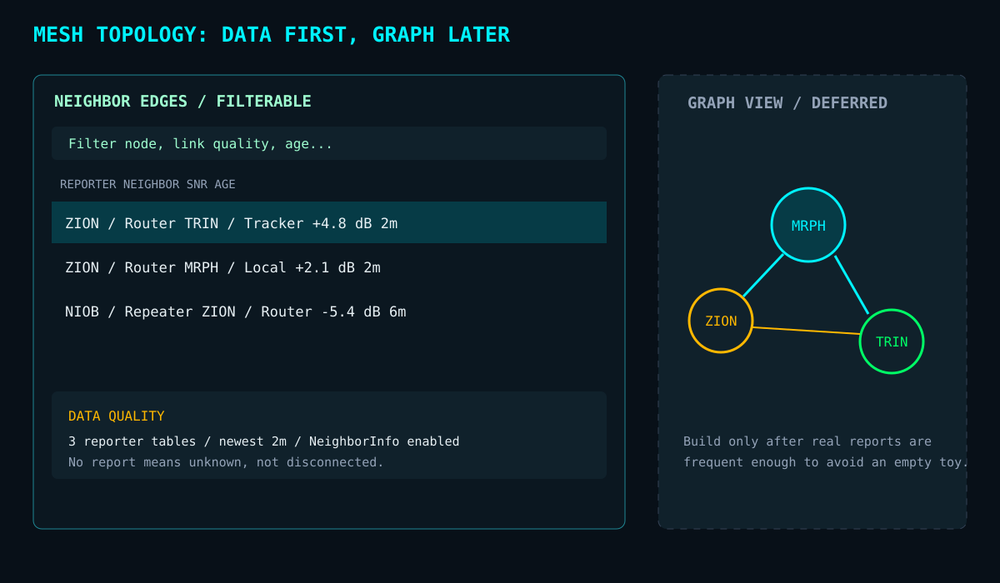

`/topology` provides a searchable, text-first edge list with recency, SNR, and data-quality information while `/mesh` retains its concise summary. Only add a graph view when real reports are sufficiently frequent; an animated empty graph would be worse than a transparent data-quality panel.

## ✅ 10. Historical Telemetry — Implemented

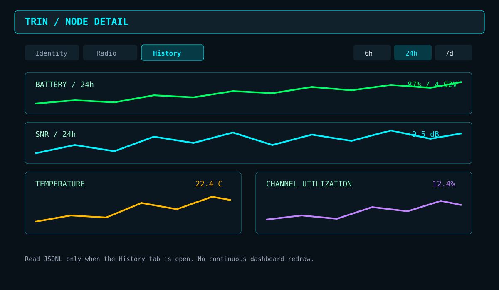

`/history <node>` reads existing JSONL snapshots only on demand and shows compact sparklines for battery, SNR, temperature, and channel utilization with 6-hour, 24-hour, 7-day, and all-time ranges. The compact node dossier exposes the same screen with `h`. It is never a continuously redrawn dashboard.

## ✅ 11. Accessibility and Theme Quality Gate — Implemented

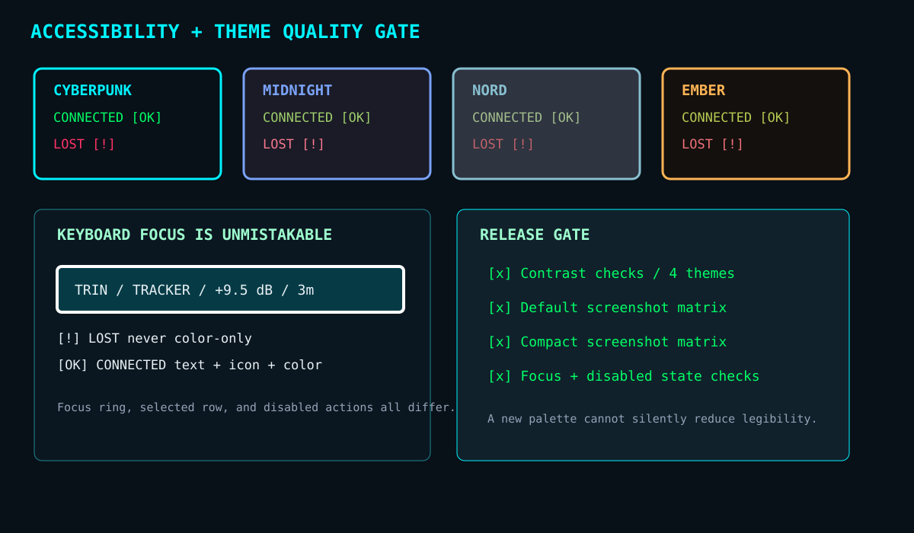

Every palette retains the same semantic roles, and operators must not depend on colour alone. The delivered gate includes:

- Visible keyboard focus with a double primary border on inputs, selectors, lists, tables, and buttons.
- Icons and text labels alongside colours for connection, SNR, and warnings.
- Automated contrast checks for semantic text roles on standard and panel backgrounds in all four themes.
- Sample Rich rendering exercised for every palette in the screenshot-generator test.

The Nord alert colour was raised to meet readable contrast on both Nord dark surfaces.

## ✅ 12. Application and Device Logs — Implemented

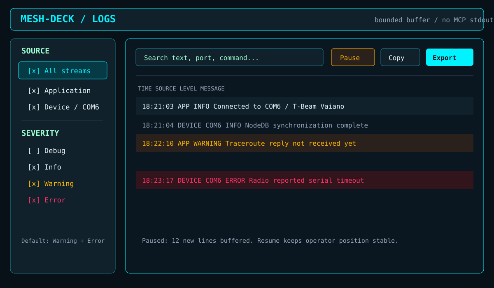

`/logs` provides diagnostics without forcing operators to leave the TUI or find terminal scrollback. It combines two explicitly labelled streams:

- **Application**: Mesh-Deck events such as connection attempts, command failures, history writes, and UI errors.
- **Device**: log lines forwarded by the connected Meshtastic radio, tagged with the serial port and firmware timestamp when supplied.

The operator filters by source and severity, pauses auto-scroll, searches, copies a selected row, and exports the currently filtered view to a local text file. The default is `Warning` and above so normal radio traffic does not turn the console into a firehose; an operator deliberately enables `Debug` while investigating a problem.

This is a viewer, not a new persistent logging subsystem: it subscribes to existing Python logging and Meshtastic `meshtastic.log.line` events, retains a bounded in-memory buffer, and leaves standard MCP stdout untouched.

## ✅ 13. Connected Device Settings — Identity Slice Implemented

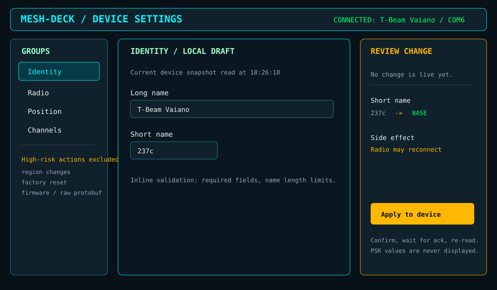

`/device-settings` is separate from `/settings`, which controls Mesh-Deck's local user preferences. The delivered identity slice reads the connected local node snapshot, validates long and short names in a local draft, shows a semantic diff in a modal confirmation, invokes the official Meshtastic `setOwner` API only after confirmation, and refreshes the local snapshot.

Identity is the only writable group in this increment. The remaining groups stay documented but non-editable until their radio-side effects have dedicated hardware validation:

| Group | Examples | Guardrail |
| :---- | :------- | :-------- |
| Identity | long name, short name | Validate required names and show the node affected. |
| Radio | modem preset, TX power, position broadcast interval | Show regulatory/coverage warning and expected reconnect or reboot. |
| Position | fixed coordinates, altitude, position precision | Validate coordinate bounds and make position sharing explicit. |
| Channels | channel name, enabled role, uplink/downlink flags | Never display or edit PSK material in the UI. |

The UI follows a transaction rather than mutating controls immediately:

1. Read and label the current radio snapshot.
2. Edit a local draft with inline validation.
3. Review a semantic diff, including side effects such as a radio reboot.
4. Require explicit **Apply to device** confirmation.
5. Show the radio acknowledgement, then re-read the snapshot.

Region changes, factory reset, firmware operations, and raw protobuf editing are deliberately excluded. They are high-risk actions that require a separate, explicit maintenance workflow.

## Explicit Non-goals

Do not add a browser map, animation-heavy topology graph, component framework, or a separate dashboard at this stage. They add dependencies and duplicate working Textual surfaces before the real operating data justifies them.
