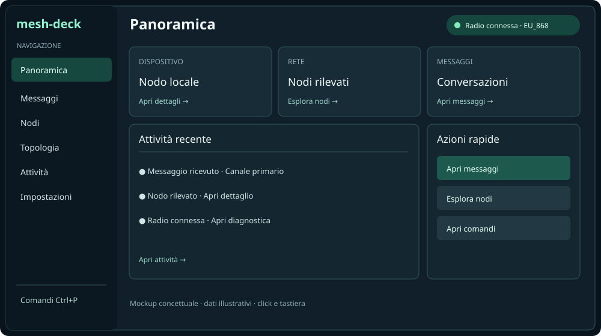
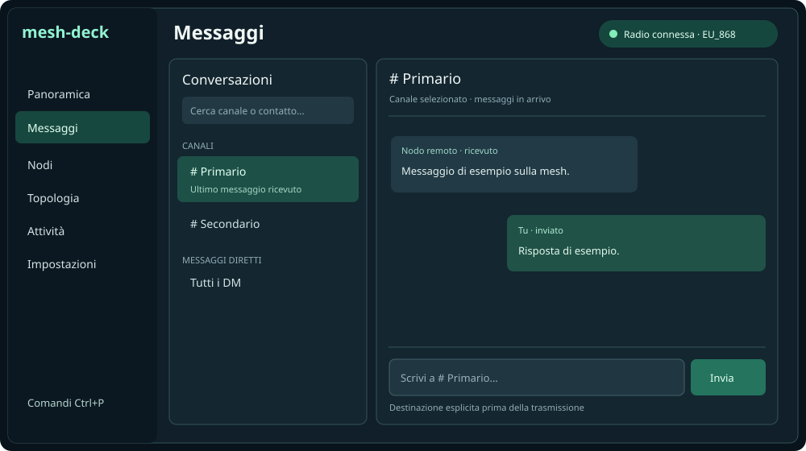

# Mesh Deck — proposta di redesign UI

> Documento di progetto, non implementazione. Riferimento: codice su `main`, 25 settembre 2026. I mockup mostrano dati illustrativi.

## Obiettivo e diagnosi

Portare Mesh Deck da console centrata su output e slash command a un'interfaccia Textual navigabile per attività. La console oggi unisce log, input e sidebar nodi (`src/mesh_deck/ui/repl.py`); la chat ha già una vista dedicata con elenco conversazioni (`src/mesh_deck/ui/channel_chat.py`). Tabelle nodi, topologia, cronologia, log e impostazioni hanno componenti o schermate dedicate. I comandi slash e l'autocompletamento sono una capacità da preservare, non l'unico modo di scoprire le funzioni.

La barra globale deve rispondere a «dove vado?», non mostrare i nodi. Canali e DM appartengono soltanto alla vista Messaggi; filtri e risultati dei nodi soltanto alla vista Nodi. Non confondere navigazione, selezione e trasmissione radio.

## Struttura proposta

| Area | Contenuto principale | Azione primaria | Origine riusabile |
| --- | --- | --- | --- |
| Panoramica | Connessione, dispositivo, riepilogo rete, attività recente e collegamenti rapidi | Apri area pertinente | Console e stato radio esistenti |
| Messaggi | Elenco canali/DM, cronologia selezionata, compositore con destinatario esplicito | Invia messaggio | `ui/channel_chat.py` |
| Nodi | Ricerca, filtri, ordinamento, tabella e dettaglio; nessuna lista globale permanente | Apri dettaglio | `ui/interactive_table.py`, `ui/node_presentation.py` |
| Topologia | Vista esistente, filtro e dettagli | Esplora | `ui/topology.py` |
| Attività | Eventi e diagnostica; separare chiaramente traffico messaggi e log tecnici | Filtra | `ui/log_viewer.py` e cronologia disponibile |
| Impostazioni | Preferenze UI e accesso distinto alle impostazioni dispositivo | Salva modifiche | Impostazioni e `ui/device_settings.py` |

Shell persistente: rail sinistra con etichetta + pulsanti per le sei aree, area centrale, stato radio sempre visibile in alto e pulsante «Comandi». La vista attiva è evidenziata anche senza colore. Il pulsante «Comandi» apre una palette ricercabile con descrizione, scorciatoia e stato di disponibilità; la sintassi slash continua a funzionare. La palette e i pulsanti devono invocare lo stesso handler applicativo, senza simulare la digitazione nello `Input` né duplicare logica.

## Stati e interazioni

- Click e tastiera sono equivalenti: Tab/Shift+Tab per il focus, Invio/Spazio per attivare; Escape chiude palette e modali, senza perdere input non inviato. Scorciatoie esistenti da verificare prima di riassegnarle.
- Stato radio: connesso, in connessione, disconnesso, errore; mostrare il dispositivo e un'azione contestuale quando utile. Nessuna metrica inventata se il dato manca o è obsoleto.
- La selezione di canale/DM cambia il contesto del compositore e rende visibile la destinazione prima dell'invio. Invio radio disabilitato quando non è possibile trasmettere; errori e conferme nello stesso contesto.
- Empty state distinti: nessun nodo rilevato, cronologia vuota, filtro senza risultati, dispositivo assente. Le schermate informative restano consultabili offline dove i dati locali lo consentono.
- La rail compatta conserva etichette leggibili o un menu accessibile: non usare icone come unico significato. Ridurre decorazioni e banner quando lo spazio verticale è limitato.
- Mantenere lingua italiana/inglese, temi semantici, preferenze persistenti e comportamento della UI già coperti da `docs/UI_DEVELOPMENT.md`; non introdurre colori hardcoded nell'implementazione.

## Piano incrementale

1. **Fondazioni.** Inventariare comandi, binding, schermate e test attuali. Definire un identificatore stabile per ciascuna area e una funzione di navigazione unica. Estrarre un'app shell/rail e lo stato della sezione attiva dalla composizione di `ui/repl.py`, senza cambiare ancora i flussi radio. Il routing deve mantenere vive le risorse/connettività correnti, senza lanciare una seconda app/event loop.
2. **Panoramica e navigazione.** Introdurre pulsanti cliccabili, stato radio globale e home con collegamenti ad aree esistenti. Implementare il ridimensionamento e il focus. I pulsanti devono navigare anche senza ricordare slash command.
3. **Messaggi e Nodi.** Integrare il comportamento di `ui/channel_chat.py` e la presentazione nodi esistente nella shell, mantenendo eventuali screen/modal dove appropriato. Rimuovere la sidebar nodi globale solo dopo che la pagina Nodi offre ricerca, filtri, ordinamento e dettaglio equivalenti. Evitare di creare una seconda sorgente di verità per i messaggi.
4. **Comandi e altre viste.** Esporre palette e slash tramite gli stessi handler. Collegare Topologia, Attività e Impostazioni alla rail; decidere la destinazione di `Ctrl+B` soltanto dopo aggiornamento di binding, documentazione e test.
5. **Qualità e rilascio.** Test Textual con pilot per click, focus/tastiera, cambio vista, stato disconnesso, resize, i18n e temi; regressioni sui test esistenti in `tests/test_ui.py`. Aggiornare `docs/USER_GUIDE.md`, `docs/CLI_REFERENCE.md` e gli screenshot solo quando la nuova UI è reale. Nessun aggiornamento prematuro alle guide.

## Criteri di accettazione

- Dalla home si raggiungono Messaggi, Nodi, Topologia, Attività e Impostazioni tramite pulsanti, senza digitare comandi.
- I comandi slash preesistenti restano funzionanti; dove esiste un'azione in palette o a pulsante, risultato ed errori coincidono.
- Nodi non occupa la rail globale; ricerca, filtri, dettaglio e accesso alla cronologia rimangono disponibili.
- Il compositore mostra la destinazione selezionata; un'azione non disponibile non produce trasmissioni radio accidentali.
- Layout usabile a dimensione terminale ridotta, con tastiera e mouse, nei quattro temi e nelle due lingue. Focus e stati non dipendono dal solo colore.
- Il cambio schermata non interrompe la connessione e non perde messaggi in ingresso; test automatici coprono almeno una transizione con arrivo di messaggio.

## Ambito escluso e scelta tecnica

Non è una proposta per riscrivere Mesh Deck come web app, né per cambiare protocollo radio, backend o configurazione Meshtastic. Prima iterazione tutta Textual, riusando i componenti attuali e refactoring progressivo; decidere eventuali nuove astrazioni dopo aver implementato la shell minima. I mockup SVG non rappresentano widget implementati o dati radio reali.

## Sviluppo su Chromebook

Con Linux abilitato sul Chromebook Plus è fattibile lavorare su documentazione, codice Python/Textual e test della UI senza nodo fisico, usando dati fittizi/test esistenti. Il test reale di connessione e invio richiede accesso al dispositivo/porta o endpoint supportato; il passaggio USB-seriale a Linux su ChromeOS va verificato sul dispositivo concreto. Windows 11, Ubuntu 24.04 e Fedora rimangono alternative per la validazione hardware.
